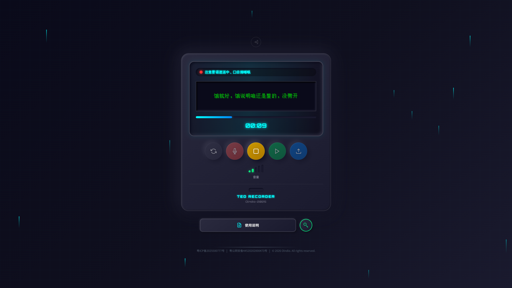
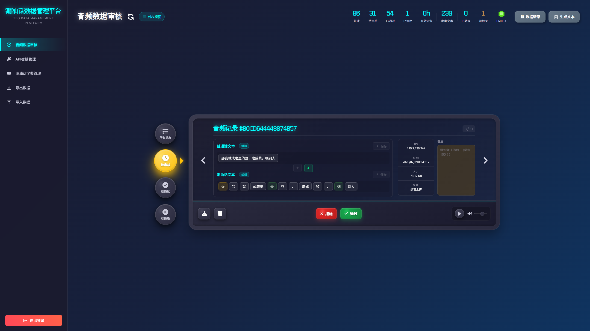
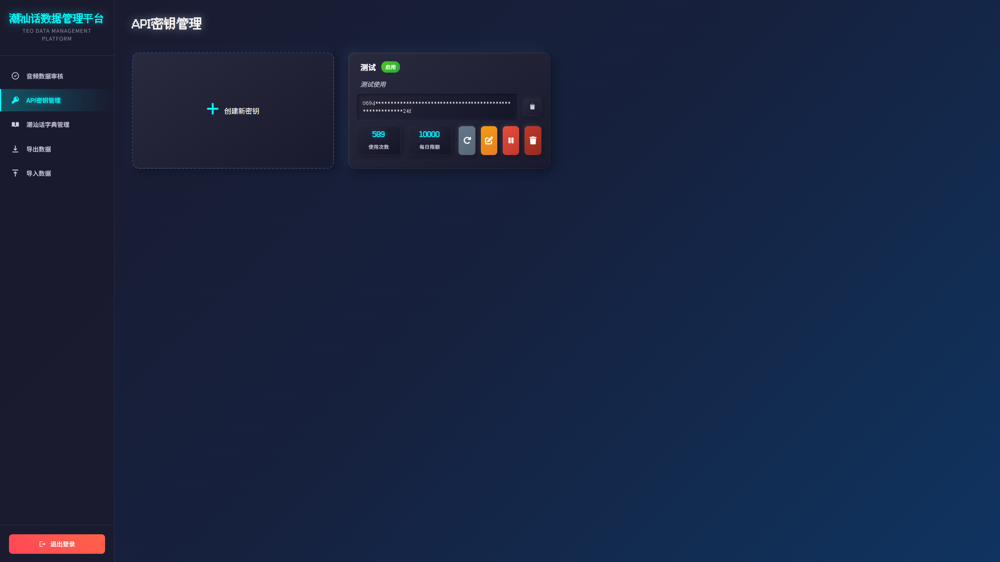
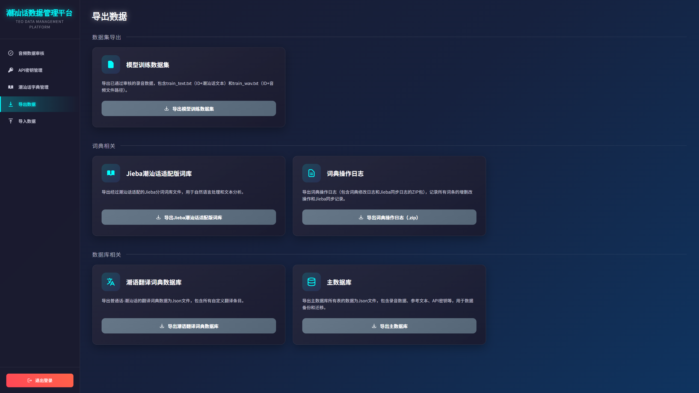
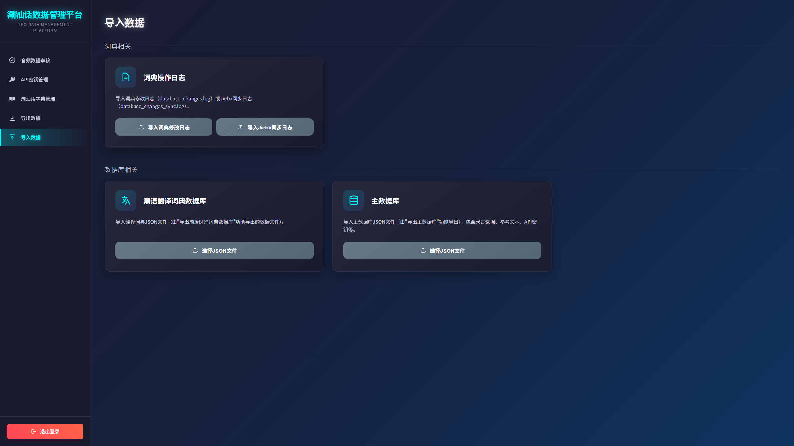
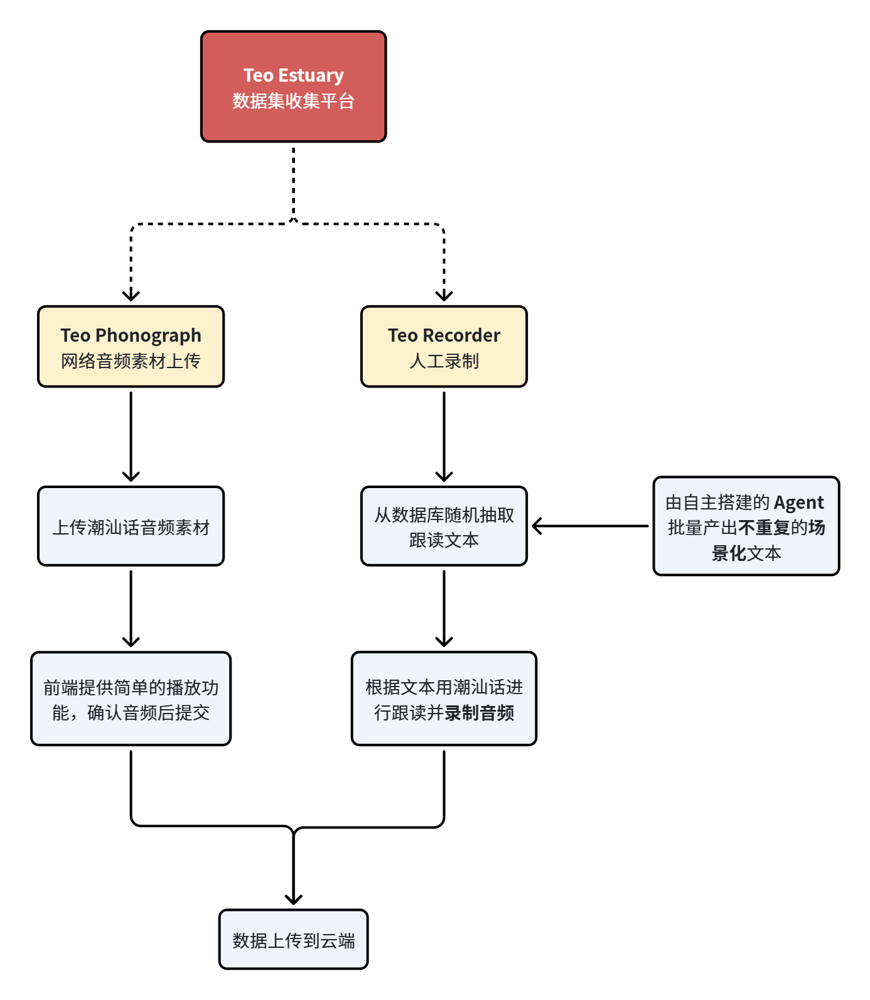
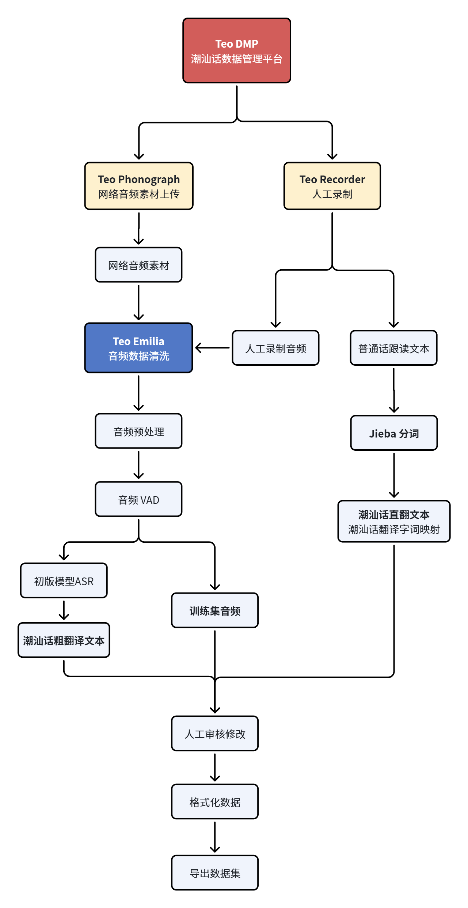
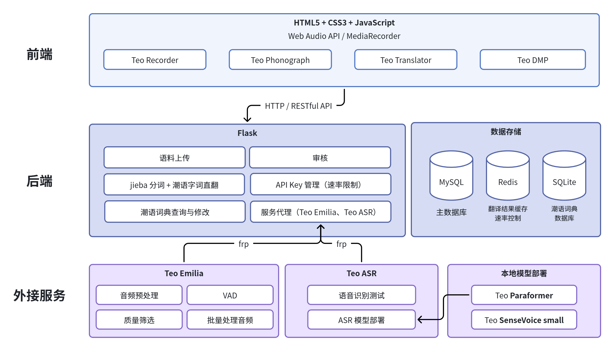

# TeoEstuary（潮汇）

> 潮汕话语料收集与标注平台 —— 汇聚方言，保存语言

[](https://opensource.org/licenses/MIT)
[](https://www.python.org/)
[](https://flask.palletsprojects.com/)
[](https://www.mysql.com/)
[](https://www.docker.com/)
[](https://developer.mozilla.org/en-US/docs/Web/JavaScript)

## 项目介绍

**TeoEstuary（潮汇）** 是一个开源的潮汕话语料收集与标注平台，致力于收集、整理和保护潮汕话这一珍贵的汉语方言。平台名称取 "Estuary"（河口/汇流处）之意，象征各地的潮汕方言语料将在此汇聚，汇入世界的洋流。

该平台针对方言场景做了诸多功能性的优化，通过该平台，开发者可以高效地采集大量潮汕话语音数据并进行标注，用于训练潮汕话自动语音识别（ASR）模型，推动方言数字化保护与传承。

我开发该工具主要是为了做一个基于方言交互的终端，而现在的潮汕话ASR效果实在太差，而且我没法基于现有模型去做针对性适配，所以只能稍微从头造轮子，以满足我的项目需求，让更多说不好、不会说普通话的潮汕中老年人也能够享受到语音识别带来的便利性。


---

## 核心功能

### 前端语料收集（三大模块）

#### 1. Teo Recorder
> **人工音频录制** — 采集者通过浏览器实时录制潮汕话音频。

- 拟物风格录音机界面，交互直观
- 提供普通话参考文本，采集者以潮汕话口语自然跟读
- 支持空格键快捷录制
- 实时音量监测与时长进度条
- 录制完成后可直接预览并上传



#### 2. Teo Phonograph
> **音频素材上传** — 上传已有的潮汕话音频文件（通过 Emilia 服务进行预处理）。

- 拟物风格 CD 播放器界面，支持播放列表（最多 10 个文件）
- 拖拽式进度控制（模拟唱片转盘）
- 音频上传后可交由 Emilia 服务进行 VAD（语音活动检测）、质量筛选和初步 ASR 自动转写
- 适合批量采集已有音频素材


#### 3. Teo translator
> **ASR 模型效果测试** — 用于测试当前版本 ASR 模型的翻译识别效果。

- 拟物风格传呼机界面，按住录音
- 实时音量监测（最长 30 秒）
- 音频发送至 ASR 服务后，以打字机效果展示识别结果
- 便于开放给他人体验当前版本模型在实际场景中的表现


---


### TeoDMP 潮汕话音频数据管理后台
#### 音频数据标注审核

- **语料审核界面**：查看、编辑、审批已上传的音频记录
- **词块编辑**：对自动翻译结果进行人工细粒度修改，提高操作效率
- **数据统计**：实时查看音频数据收集进度与各状态分布
- **音频处理与转录**：手动进行「数据转录」可以将 Teo Phonograph 上传的音频数据进行批量处理与筛选，借助初版ASR模型对音频进行粗翻译，从而得到粗糙的潮汕话文本
- **分词直翻**：Teo Recorder提交数据时会同步提交音频和跟读文本到后端，此时后端会自动将跟读文本通过Jieba进行分词，并查询潮语词典进行逐词翻译，最后将结果作为初步的潮汕话文本，尽可能提高标注人员效率。
  - Teo Phonograph上传的音频在经过初版ASR翻译得到粗糙的潮汕话文本后，也会经过分词直翻，得到初步的普通话文本
- **生成跟读文本**：当 Teo Recorder 将数据库中的跟读文本抽取殆尽时，后端会自动触发跟读文本生成，向智能体发送请求批量生产跟读文本并插入数据库。也可通过「生成文本」按钮手动触发。




#### API Key 管理
> 为不同采集渠道分配独立的 API 密钥，实现渠道隔离与用量追踪。

- 支持新增、编辑、删除 API Key
- 为每个 Key 设置渠道名称、权限标签及备注
- 可查看各渠道的调用次数统计
- 一键复制 Key 便于分发给采集人员



#### 潮语词典查询
> 查询普通话↔潮汕话对照词条，快速修正翻译结果。

- 帮助标注员在审核时快速查找正确译法
- 支持双向查询（普通话↔潮汕话）
- 显示词条变体、优先级与备注信息（优先级可以控制在“潮汕话-普通话分词直翻”阶段优先使用的词语）
- 可直接在词典中新增或编辑词条
- 词典修改操作会记录在“词典操作日志”中，操作完成后可手动将修改同步至Jieba词典，便于快速适配最新的词典进行分词


---

#### 数据导入导出

平台支持完善的数据导入导出功能，可在管理后台中操作：

##### 导出




| 导出内容 | 格式 | 说明 |
|---------|------|------|
| 训练数据集 | `.zip` | 包含 `train_text.txt`（潮汕话文本）和 `train_wav.txt`（音频路径），可直用于 ASR 模型训练 |
| 翻译词典 | `.json` | 普通话↔潮汕话对照词库（含变体、优先级、备注） |
| Jieba 分词词库 | `.txt` | 适配 jieba 的潮汕话分词词典 |
| 词典操作日志 | `.zip` | 包含数据库修改日志和同步日志 |
| 主数据库完整备份 | `.json` | 包含 recordings、reference_text、api_keys、generation_tasks 等所有表数据 |

##### 导入



| 导入内容 | 支持格式 | 模式 |
|---------|---------|------|
| 主数据库 | `.json` | 增量追加 / 全量覆盖 |
| 翻译词典 | `.json` | 增量追加 / 全量覆盖 |
| 词典操作日志 | `.log` | 增量追加 / 全量覆盖 |

---

### 数据收集与处理流程


#### Teo-Estuary数据收集流程



#### Teo-DMP数据处理流程



---

## 技术架构



### 技术栈

| 层级 | 技术 | 用途 |
|-----|------|------|
| 前端 | HTML5 / CSS3 / JavaScript | 页面结构与样式、交互逻辑 |
| 前端音频 | Web Audio API、MediaRecorder API | 音频录制与播放 |
| 后端 | Python 3.11+ / Flask 3 | RESTful API 服务 |
| ORM | Flask-SQLAlchemy | 数据库操作 |
| 数据库 | MySQL 8.0 | 主数据存储 |
| 缓存 | Redis | 翻译缓存、速率限制存储 |
| 词典库 | SQLite | 独立翻译词典数据库 |
| 分词 | jieba | 普通话文本分词 |
| 部署 | Docker Compose | 容器化一键部署 |
| 包管理 | Pixi | Python/前端统一环境管理 |

### 外部服务依赖

| 服务 | 用途 | 默认端口 |
|-----|------|---------|
| Teo-Emilia | 音频 VAD / 质量筛选 / 初步 ASR | 5029 |
| Teo-ASR Service | 潮汕话语音识别 | 5026 |
| Dify Agent | 参考文本生成工作流 | 需要本地部署并自行配置 Url |

> **注意**：此服务都为独立部署的服务，由于服务器算力不足，因此目前是利用本地算力部署再内网穿透到服务器进行使用，平台通过 HTTP API 与其通信。这部分还需要做代码整理和遵循开源协议的一些工作，后续会逐步开源。

---

## 快速开始

### 环境要求

- Python 3.11+
- Docker & Docker Compose（用于 Docker 部署）
- [Pixi](https://pixi.sh/latest/)（推荐，用于本地开发）

### 方式一：Docker 部署后端（推荐）

后端支持 Docker 一键部署，前端通过 Python 启动：

```bash
# 1. 后端 Docker 部署
cd backend/docker

# 创建必要目录
mkdir -p instance data/data data/logs data/teo_g2p_logs data/teo_g2p_word_dict

# 配置环境变量
cp .env.example .env
# 编辑 .env，填写 SECRET_KEY 和 ADMIN_PASSWORD

# 启动服务
docker-compose up -d
```

访问：
- 管理后台：`http://localhost:5001/admin`
- 健康检查：`http://localhost:5001/health`

```bash
# 2. 前端启动（另一终端）
cd frontend
python -m http.server 8080 --directory src
```

### 方式二：本地开发（推荐使用 Pixi）

#### 前后端分别启动

```bash
# 安装 pixi
curl -fsSL https://pixi.sh/install.sh | sh

# 同时启动前后端（开发模式）
pixi run start-all
```

或分别启动：

```bash
# 终端 1：后端
cd backend
pixi run start

# 终端 2：前端
cd frontend
pixi run serve
```

#### 传统方式（无需 pixi）

```bash
# 后端
cd backend
python -m venv venv
source venv/bin/activate  # Windows: venv\Scripts\activate
pip install -r requirements.txt
cp .env.example .env  # 填写配置
python run.py

# 前端（另一终端）
cd frontend
python -m http.server 8080 --directory src
```

---

## 环境变量配置

1. Docker 部署需要配置 .env
详见 backend \ docker \ .env.example, 在同一目录将其复制为 .env，并根据注释进行配置

2. 前端部署需要配置 config.js
详见 frontend \ src \ js\ config.example.js, 在同一目录将其复制为 config.js，并根据注释进行配置

---

## 项目结构

```
TeoEstuary-dev/
├── README.md
├── frontend/                          # 前端（纯静态页面）
│   └── src/
│       ├── index.html                 # 平台首页
│       ├── css/                       # 共享样式
│       ├── js/
│       │   ├── config.js              # API 配置
│       │   └── key-manager.js          # API Key 管理
│       ├── teo-recorder/              # 潮汕话人工录制音频
│       ├── teo-phonograph/             # 潮汕话音频素材上传入口
│       └── teo-translator/             # 潮汕话ASR体验入口
├── backend/                           # 后端（Python Flask）
│   ├── run.py                         # 启动入口
│   ├── requirements.txt               # Python 依赖
│   ├── app/
│   │   ├── models.py                  # 数据模型（MySQL）
│   │   ├── api/                       # API 蓝图
│   │   │   ├── recordings.py          # 语料上传/审核
│   │   │   ├── text.py                # 翻译服务
│   │   │   ├── dictionary.py          # 词典管理
│   │   │   ├── asr.py                 # ASR 代理
│   │   │   ├── reference.py           # 参考文本生成
│   │   │   └── data_management.py      # 数据导入导出
│   │   ├── teo_g2p/                   # 潮语翻译模块
│   │   │   ├── translation_service.py  # jieba + 词典翻译
│   │   │   ├── word_dict/             # 翻译词典（SQLite）
│   │   │   └── ...
│   │   └── admin/                     # 管理后台
│   ├── templates/
│   │   ├── admin.html                 # 管理界面 HTML
│   │   └── admin_login.html           # 管理员登录页
│   ├── docker/                        # Docker 部署配置
│   │   ├── Dockerfile
│   │   ├── docker-compose.yml
│   │   └── README.md                  # Docker 部署文档
│   └── data/                          # 数据存储
│       ├── uploads/                   # 待审核音频
│       ├── good/                      # 通过音频
│       └── bad/                       # 拒绝音频
```

---

## 待办


1. 项目中的语音清洗程序Teo-Emilia（基于开源项目Emilia做了二开适配）也会在后面逐步开放。（目前用于清洗Teo-Phonograph上传的音频）
2. 自动批量产出不重复跟读文本的智能体后续也会进行开源。（用于Teo-Recorder产出跟读文本）
3. Teo-Recorder收集的音频目前还没有经过Emilia去做音频清洗，这块也是后面要完善的一个重要部分。
4. 项目的文档部分还不够完善，后面会一步步去撰写完善使用文档。

（至于Teo-ASR，我仅仅只是基于FunASR官方的语音识别示例做了一个匹配的简单的后端，其实没有太多开源的必要，后面看情况考虑要不要开放吧。）

---

## 开源协议

本项目基于 [MIT License](LICENSE) 开源。
部分代码受项目teochew-g2p启发实现，遵循 BSD-2-Clause 协议，详见 THIRD-PARTY-NOTICES。

---

## 自述&致谢

整个项目实现的技术栈没有用什么高效高级的技术，因为事实上这些只是我接触最多的技术栈（事实上大部分还是Vibe Coding出来的），所以也没考虑太多性能什么的，用起来顺手就行，而且以目前的成果来看，作为一个我个人使用的工具来说，目前的性能和体验已经完全足够了。如果说后续会有人帮我收集语料和标注的话，可能会再考虑去重构吧，但目前是暂时没有这个需求。

感谢以下开源项目和人员给予的启发和帮助，以及感谢诸多还在为潮汕话识别努力的工作者。
- Emilia：https://github.com/open-mmlab/Amphion/blob/main/preprocessors/Emilia/README.md
- FunASR：https://github.com/modelscope/FunASR
- Teochew-g2p：https://github.com/p1an-lin-jung/teochew-g2p
- 编程分享录（B站up主）：https://space.bilibili.com/674558378?spm_id_from=333.788.upinfo.head.click

---

## 联系方式

- **作者**：Orlando Hsu
- **邮箱**：orlandohsu29@163.com
